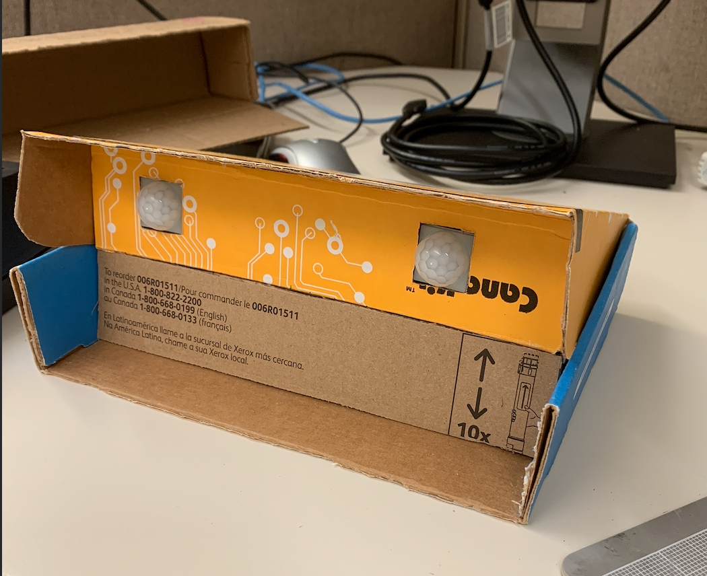

This door sensor is a project I have created that was based on my sophomore project that was completed in Spring 2018.

Originally created using an Arduino in a group setting, I decided to recreate the project for my previous workplace, the Manoa Career Center, at the University of Hawaii at Manoa for one of the Career Fair events we would hold every semester. This recreation of the project included two PIR sensors that were configured side-by-side. The logic was based on triggering one sensor before the other as an individual would enter or exit a room. Depending on which sensor was triggered first, the program would determine it either an enter or exit as the contraption would be placed next to a doorframe.

These determinations would then be summed into a total that would reflect the number of individuals in a room.
 
