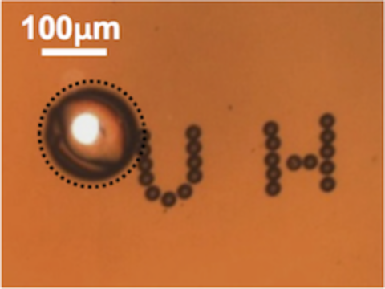

As a member of the Embryo Image Analysis team, I have concentrated on the creation of image augmentation scripts in both MATLAB and Python as well as image labeling with the utilization of the MATLAB Image Labeling toolbox. Provided with videos of embryos that are turned into individual frames for analysis, we are able to train a neural network that we then use to analyze embryo growth and viability.

The team has also created an application for users to easily understand the results of the analysis in MATLAB, which may also be translated to Python as the project is currently working to become open-source.

Find more information regarding the Microrobotics VIP team [here](https://sites.google.com/a/hawaii.edu/uh-vip/teams/micro).

