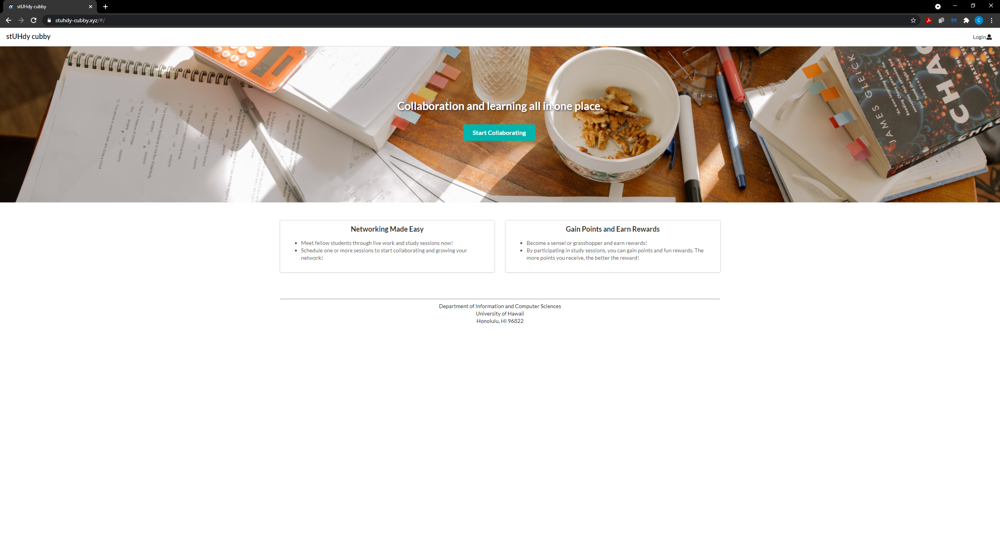

## Project Overview
  The objective of this project is to provide University of Hawaii at Manoa students who are of ICS and Computer Engineering majors to network and collaborate with one another through online sessions for providing or receiving help. As learning in a group setting may be beneficial to many students, the stUHdy cubby application provides students with the capability to schedule study sessions with one another for the purpose of collaborating on school work and studying.
  
  This project has been developed and designed by the following team: [Yhanessa Sales](https://yhanessaanne.github.io/), [Susan Ma](https://susankpma.github.io/), and [Christine Ramos](https://christinebramos.github.io/) (myself)
 
## Development
  The project has been implemented using Semantic UI React with a Meteor platform. All database related development was managed using MongoDB.

#### More information regarding the project and source code can be found below:

[Github Organization Page](https://stuhdy-cubby.github.io/)

[Source Code](https://github.com/stuhdy-cubby/stuhdy-cubby)

## Contributions
  My contributions to this project include the development and design of the web application's landing, admin, profiles, and user profile pages. 
  
### Landing/Home Page

  The landing/home page has been developed and designed with the project's purpose in mind allow with user accessibility. The team wanted to provide users with an overview of the application and easy access to its capabilities.
  

  
### Admin Home Page

  The admin home page has been developed and designed to provide users with the 'admin' role access to all created sessions within the application. Admin users are able to view the details of created sessions in table view for easy viewing. Details such as course, topic, date/time, location, and owner are able to be seen.
  
  Admin users are also able to add sessions through this page by clicking the 'Add Session' button which will direct them to the 'Add Session' page. All sessions created by admin users can be seen in the 'My Sessions' table for organization purposes along with the 'All Sessions' table.
  

  
### Profiles Page
  The profiles page has been designed and developed to allow users to view other users and their profile details. By viewing the profiles listed on the page, users are able to view profile details of selected users such as their email, institution, class standing, interests, and skills. This page provides users with the ability to connect and network with others who may share the same profile details.
  
  All profile details are updated when users update their profile information via their profile page.
  

  

  
### User Profile Page

  The user profile page has been developed and designed with users' information management in mind. From this page, users will be able to view and edit their profile details via a form they have completed through registering their account. Users are able to edit their information at any time and will update their profile details on the Profiles page shown above. Users' created sessions will also be displayed on the right sidebar to provide them with visual reminders.
  

## Learning Experience

  This final project was an accumulation of all technology and concepts taught during the semester. By working alongside a very responsive and collaborative team, I was able to practice my technical skills in web development while getting accustomed to Agile Project Management, specifically, Issue Driven Project Management. Soon transitioning into work as a full-time Software Engineer, completing this project has given me motiviation and inspiration to continue in this line of work. By completing the project, I have been able to add Javascript, Meteor, MongoDB, and Semantic UI React to my toolset and experience, which I will forever be grateful for.
  
  Working alongside my fellow team members  [Yhanessa Sales](https://yhanessaanne.github.io/) and [Susan Ma](https://susankpma.github.io/), we were able to complete the project in an efficient manner. With team meetings twice a week and open continuous updates and communication, we were able to implement additions and changes with little to no complications. Great team collaboration and efforts also allowed us to freely express our opinions and thoughts while still working side-by-side and reaching deadlines in advance.
  
  Overall, this final project has further deepened my passion for software development and technology while also being a wonderful learning experience.
  
  
